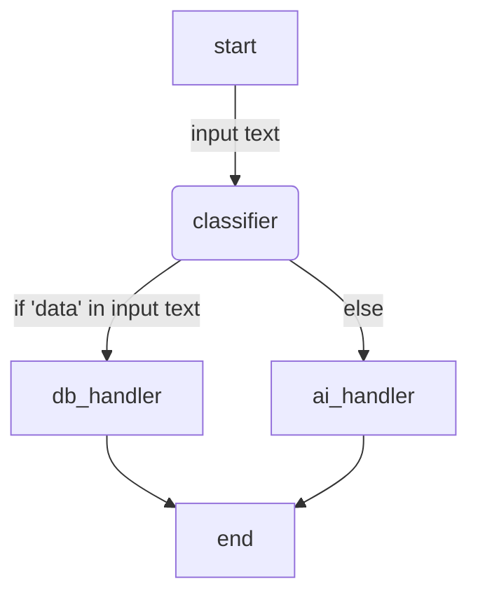

## Basics

### Langgraph as a finite automata

Why langgraph?  Because

- **Loops:** Retry a tool call if it fails, or re-ask an LLM if its output failed validation.
    
- **Branching:** Take Path A if the user asks for policy info, or Path B if they want to execute an action.
    
- **Long-Running State:** Maintain memory across multiple turns, agent reasoning steps, and human approvals.

Traditional chains break down when you try to force them into complex loops because they are **Directed Acyclic Graphs (DAGs)**—they cannot go backward or loop infinitely.

LangGraph solves this by turning your application into a **Stateful Cyclic Computational Graph** (essentially a finite state machine).
### States, nodes, and edges

In LangGraph, everything revolves around a shared state graph. 

Unlike a linear script or standard functional calls, a LangGraph application is a state machine where execution flows through **Nodes** that read and write to a shared **State**.

- **Nodes:** Python functions that take the current state as input, perform work (like calling an LLM or running a database query), and return a dictionary containing state updates.
	- **LLM node**: a node where logic is executed via an LLM
	- **Tool Node:** Executes external tools as part of the agent's workflow.
	- **Action/agent Node:** Invokes another agent from within the current agent.
	- **Logic Node:** Executes any custom logic that doesn't fit into the other node types.
	- **start node**: the starting node of the graph
	- **end node**: the end node of the graph.
- **Edges:** Directives that tell the graph what node to run next, because each node is connected to another node via an edge.
	- **conditional edge**: helps route requests to a connected node based on conditional checks
- **state**: reflects the internal state of the agent, storing info about the execution of the graph, where each node writes its output to the state.
	- **schema typing**: You define what data your graph carries around using Python's `TypedDict` or Pydantic. 
	- **dynamic**: By default, fields are overwritten when a node returns them, but you can use reducers (like `operator.add`) to append data (e.g., keeping a growing message history).


Here is the simplest example, and let's notice some things here:

- **state schema**: we have type safety for the state
- **node functions**: you create node functions as normal python functions that take in state and return state, exactly typed. State goes in, state comes out
- **nodes**: you refer to nodes by the name you give them in the graph.

```py
from langgraph.graph import StateGraph, START, END
from typing import TypedDict

# 1. Define the State
class State(TypedDict):
    message: str

# 2. Define a Node function
def process_message(state: State) -> State:
    new_msg = state["message"] + " -> Processed by node!"
    return {"message": new_msg}

# 3. Initialize the graph with the state schema
workflow = StateGraph(State)

# 4. Add nodes and edges
workflow.add_node("processor", process_message)
workflow.add_edge(START, "processor")
workflow.add_edge("processor", END)

# 5. Compile into an executable app
app = workflow.compile()

# Run it: graph accepts State as input
result = app.invoke({"message": "Hello HHMI"})
print(result)  # Output: {'message': 'Hello HHMI -> Processed by node!'}
```


#### State

Instead of passing around messages arrays everywhere, instead, we delegate state management and conversation history to the state.

Agent state is a key concept in LangGraph for building AI agents. It acts as a shared memory during the execution of the agent's workflow, where each node writes its output to the agent state and subsequent nodes read from it to get their inputs. 

- Unlike edges, which only control the flow between nodes, the actual data is passed through this agent state. 
- This allows the agent to maintain and manage information throughout the process, enabling complex, multi-step reasoning and actions within the chatbot.

1. Nodes write their output to the state
2. Subsequent nodes read their input from state

> [!NOTE]
> No data is exchanged through edges. Data is always exchanged through agent state. 

In LangGraph, the **State** is the single source of truth for your entire application. Think of it as a shared whiteboard or a context object that gets passed around a team of workers.

Every time a node in your graph runs, it reads from this whiteboard, does its work, and writes updates back to it.

In Python, we define this State using a `TypedDict` or a Pydantic model:

```py
from typing import TypedDict, List
from typing_extensions import Annotated
import operator

class EnterpriseAgentState(TypedDict):
    # 1. Standard overwrite key
    user_query: str
    
    # 2. Reducer key (Appends new items instead of overwriting)
    messages: Annotated[List[str], operator.add]
    
    # 3. Operational metadata
    execution_status: str
```

Look closely at the `messages` field above:

- **Default Behavior (Overwrite):** For `user_query` or `execution_status`, whenever a node returns `{"execution_status": "COMPLETED"}`, it **overwrites** whatever value was there previously.
    
- **Reducer Behavior (`operator.add`):** For `messages`, if Node A returns `{"messages": ["Hello"]}` and Node B returns `{"messages": ["World"]}`, LangGraph uses `operator.add` to compute `["Hello"] + ["World"]` $\rightarrow$ `["Hello", "World"]`.


####  Nodes

In LangGraph, a node is simply a **Python function** that takes the current state as its parameter and returns a dictionary containing state updates.

$$\text{State Input} \longrightarrow \text{Node Function} \longrightarrow \text{State Updates (Dictionary)}$$
Here are the core rules of the node function:

- **Input:** Must take at least one parameter (conventionally named `state`), which receives a dictionary matching your state schema.
    
- **Output:** Must return a dictionary containing _only_ the key-value pairs you want to update or append in the state. You don't need to return the full state object—just the changes.
    
- **Side Effects & Logic:** Inside the node, you can write pure Python code: make an HTTP request to an API, execute a database query, invoke an LLM, or process text.

Here's an example:

```py
import time
from typing import Dict, Any

# Assuming our EnterpriseAgentState from step 1:
def retrieve_docs_node(state: EnterpriseAgentState) -> Dict[str, Any]:
    """Node that simulates retrieving internal HR or policy docs."""
    query = state["user_query"]
    
    # 1. Do some work using data from state
    print(f"[LOG] Querying enterprise database for: {query}")
    time.sleep(0.5) # Simulating network latency
    
    retrieved_content = f"Policy Document: Remote Work Policy 2026 for '{query}'"
    
    # 2. Return state updates
    return {
        "messages": [f"Retrieved document: {retrieved_content}"],
        "execution_status": "DOCS_RETRIEVED"
    }
```

Notice what happened here:

1. We read `user_query` from `state`.
2. We performed our operation as side effects
3. We returned the new state: dictionary with updates for `messages` (which gets appended) and `execution_status` (which gets overwritten to `"DOCS_RETRIEVED"`).


#### Edges and graphs
##### Compiling the graph

To create a graph, we need to follow four core steps:

1. Instantiate the graph with the schema

```py
from langgraph.graph import StateGraph, START, END

# 1. Instantiate the graph with the schema
builder = StateGraph(EnterpriseAgentState)
```

2. Add node functions to the graph with a string identifier, which creates a node and adds it to the graph.
3. Add edges between nodes, starting from `START` node and ending at `END` node
4. Compile the graph


```py
from langgraph.graph import StateGraph, START, END
import time
from typing import Dict, Any
from typing_extensions import Annotated
import operator

class EnterpriseAgentState(TypedDict):
    # 1. Standard overwrite key
    user_query: str
    
    # 2. Reducer key (Appends new items instead of overwriting)
    messages: Annotated[List[str], operator.add]
    
    # 3. Operational metadata
    execution_status: str

# Assuming our EnterpriseAgentState from step 1:
def retrieve_docs_node(state: EnterpriseAgentState) -> Dict[str, Any]:
    """Node that simulates retrieving internal HR or policy docs."""
    query = state["user_query"]
    
    # 1. Do some work using data from state
    print(f"[LOG] Querying enterprise database for: {query}")
    time.sleep(0.5) # Simulating network latency
    
    retrieved_content = f"Policy Document: Remote Work Policy 2026 for '{query}'"
    
    # 2. Return state updates
    return {
        "messages": [f"Retrieved document: {retrieved_content}"],
        "execution_status": "DOCS_RETRIEVED"
    }

def format_summary_node(state: EnterpriseAgentState):
    # 1. Read the last message from the list
    last_msg = state["messages"][-1]
    
    # 2. Transform it
    formatted_msg = f"[FINAL SUMMARY]: {last_msg.upper()}"
    
    # 3. Return the state updates
    return {
        "messages": [formatted_msg],  # Appends via operator.add
        "execution_status": "COMPLETED"
    }
    
# 1. Instantiate the graph with the schema
builder = StateGraph(EnterpriseAgentState)

builder.add_node("retriever", retrieve_docs_node)
builder.add_node("formatter", format_summary_node)

builder.add_edge(START, "retriever")
builder.add_edge("retriever", "formatter")
builder.add_edge("formatter", END)

# 4. Compile the graph into an executable application
app = builder.compile()
```

Once you compile the graph, you can pass input state into it and it will flow through the graph:

```py
initial_input = {
    "user_query": "Hybrid Work Limits",
    "messages": [],
    "execution_status": "INIT"
}

output = app.invoke(initial_input)
print(output)
```
##### Conditional edges

Instead of pointing from Node A directly to Node B, a **conditional edge** evaluates the current state and routes execution to different nodes based on runtime logic.

A **conditional edge** doesn't point directly to a fixed node. Instead, it takes the current state, passes it to a **routing function** (a decision function), and uses the return value to decide which node to visit next.

$$\text{Node A} \longrightarrow \text{Routing Function(State)} \xrightarrow{\text{Evaluates Path}} \begin{cases} \text{Path 1} \rightarrow \text{Node B} \\ \text{Path 2} \rightarrow \text{Node C} \end{cases}$$

Here's a step by step construction:

- **Write the Nodes** (the work to be done).
    
- **Write the Router Function** (pure Python function that inspects the state and returns a string key representing the decision).
    
- **Add `add_conditional_edges`** to the graph builder.

```py
# 1. The Router Function
def route_next_step(state: EnterpriseAgentState) -> str:
    """Evaluates state to pick the next node."""
    status = state.get("execution_status")
    
    if status == "DOCS_RETRIEVED":
        return "go_to_formatter"
    else:
        return "go_to_error_handler"

# 2. Registering on the Graph
builder.add_conditional_edges(
    "retriever",  # Source node where decision happens AFTER it runs
    route_next_step,  # The decision function
    {
        # Map: "Router Output String": "Destination Node Name"
        "go_to_formatter": "formatter",
        "go_to_error_handler": "error_handler"
    }
)
```

**example**

Here's the graph logic:

1. **START**: start at start node, create edge to classifier node
2. **classifier**: 2nd node in graph, branches to either `db_handler` or `ai_handler` nodes.




```py
from langgraph.graph import StateGraph, START, END
from typing import TypedDict

class RouterState(TypedDict):
    input_text: str
    route: str

def classifier_node(state: RouterState):
    # Simulated classification logic
    text = state["input_text"]
    destination = "database_team" if "data" in text else "ai_team"
    return {"route": destination}

def db_handler(state: RouterState):
    return {"input_text": "Handled by Database Team"}

def ai_handler(state: RouterState):
    return {"input_text": "Handled by AI Accelerator Team"}

workflow = StateGraph(RouterState)
workflow.add_node("classifier", classifier_node)
workflow.add_node("db_handler", db_handler)
workflow.add_node("ai_handler", ai_handler)

workflow.add_edge(START, "classifier")

# Define routing function for conditional edge
def decide_path(state: RouterState):
    return state["route"]

workflow.add_conditional_edges(
    "classifier",
    # function that returns value
    decide_path,
    # value mappings from function return value to corresponding nodes
    {
        "database_team": "db_handler",
        "ai_team": "ai_handler"
    }
)

workflow.add_edge("db_handler", END)
workflow.add_edge("ai_handler", END)

app = workflow.compile()
```


**DB handler flow**

1. Pass in input state into the graph

```py
app.invoke({"input_text" : "wow I need me some data"})
```

2. Flow goes as follows

### Memory

Memory is added via a checkpointer, and then whenever you add a checkpointer, you must scope it to a specific thread to keep track of an individual session's state.

```py
from langgraph.graph import StateGraph, START, END
from langgraph.checkpoint.memory import MemorySaver
from typing import TypedDict

class ChatState(TypedDict):
    history: list

def chat_node(state: ChatState):
    return {"history": state["history"] + ["New interaction response"]}

workflow = StateGraph(ChatState)
workflow.add_node("chat", chat_node)
workflow.add_edge(START, "chat")
workflow.add_edge("chat", END)

# Initialize in-memory checkpointer (or use PostgresSaver for production)
memory = MemorySaver()
app = workflow.compile(checkpointer=memory)

# Pass a thread config ID to track session state
config = {"configurable": {"thread_id": "session-xyz-123"}}
app.invoke({"history": ["User greeting"]}, config)
```


### Prebuilt agents

#### ReAct agent

Let's create this agent, where a ReAct agent is just a normal langchain agent.


1. Create a base LLM

```py
from langchain.chat_models import init_chat_model

model = init_chat_model("groq:openai/gpt-oss-120b")
```

2. Create the tools

```py
from langchain.tools import tool

@tool
def find_sum(x:int, y:int) -> int :
    #The docstring comment describes the capabilities of the function
    #It is used by the agent to discover the function's inputs, outputs and capabilities
    """
    This function is used to add two numbers and return their sum.
    It takes two integers as inputs and returns an integer as output.
    """
    return x + y

@tool
def find_product(x:int, y:int) -> int :
    """
    This function is used to multiply two numbers and return their product.
    It takes two integers as inputs and returns an integer as ouput.
    """
    return x * y
```

3. Create the agent

```py
from langchain.agents import create_agent
from langchain.messages import AIMessage,HumanMessage,SystemMessage

#System prompt
system_prompt = SystemMessage(
    """You are a Math genius who can solve math problems. Solve the
    problems provided by the user, by using only tools available. 
    Do not solve the problem yourself"""
)

# langchain agents are same as ReAct agents
agent_graph=create_agent(
    model=model,
    tools=[find_sum, find_product],
    system_prompt=system_prompt,
    debug=True # allows debugging
)
```

## Middleware and Interrupts

### Human in the loop

For high-consequence enterprise actions (like triggering infrastructure deployments or database writes), agents cannot act blindly. LangGraph handles this natively via **interrupts**.

- **How it works:** You configure the graph to pause execution _before_ a sensitive node runs. The state is saved, control returns to your application layer, and a human can review, approve, or modify the state before resuming.

```py
# Compiling with an interrupt before the dangerous execution node
app = workflow.compile(
    checkpointer=memory,
    interrupt_before=["execution_node"] # Pauses right before running this node
)

# When invoked, execution stops at the boundary of 'execution_node'
# A human inspects state via: app.get_state(config)
# To resume execution after approval:
app.invoke(None, config) # Passes None to resume from the checkpoint
```

## Langgraph JS